# Petductivity 

## About
Petductivity is an Android mobile application that provides you with the motivation to plan and focus on your daily tasks. The application seeks to help users plan and execute their essential tasks (eg. homeworks and projects) by giving reminders and rewards users with in-app achievements.

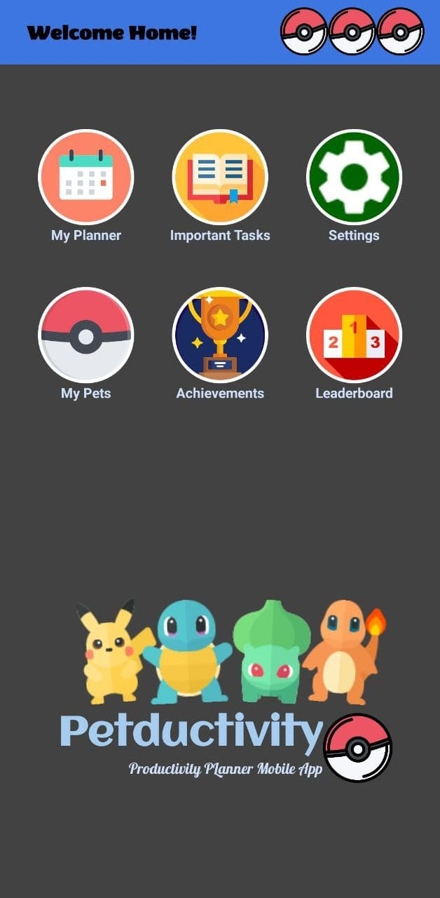

## Installation

You can try out our application by downloading it from [here](https://drive.google.com/file/d/1c2lXfnOhVCkVk_ovGtj6ceajoYZQ5ZH7/view?usp=sharing).

Ensure that your device runs on Android API 26 and above, otherwise some features may not work as expected.
**Take note**: 
1. Ensure that your device runs on Android API 26 and above, otherwise some features may not work as expected.
2. This application is meant for Android mobile phones only, hence if you are using a tablet, it may not work as expected.
3. This application is meant to be used in vertical mode only, hence if you used it in horizontal mode, it may not work as expected.
4. This application is still under-developing, we welcome any feedback and suggestions.

## Main Features
* My Planner
* Important Task
* Settings
* My Pets
* Achievements
* Leadersboard
* Focus Mode

## Login & Registration

1. Register an account with a valid email address. 
2. Select a password that is atleast 6 characters long.
3. Select your favourite pet (Bulbasaur, Charmander, Squirtle or Pikachu) by clicking on the respective pokeballs.
4. Verify your account by clicking on the link sent to your registered email address.
5. Login to start using the app.

To register: Click on `Need an account? Create an Account Here!`

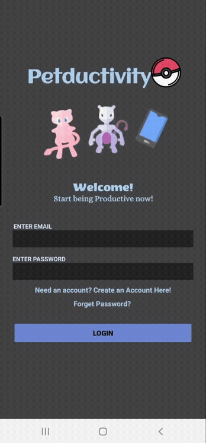 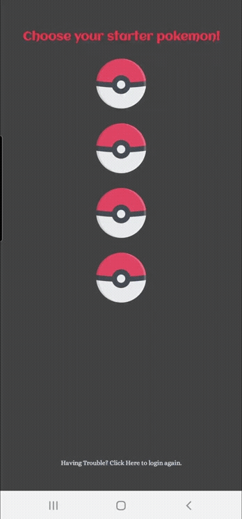

Additional Feature: If you have forgotten your password, fret not! You can reset your passsword by clicking on `Forget Password` at the Login Page.

## My Planner

You will be able to see the overview of the entire month. 
Click on the specific date that you wish to plan your activites. You will be brought to a week view page. 

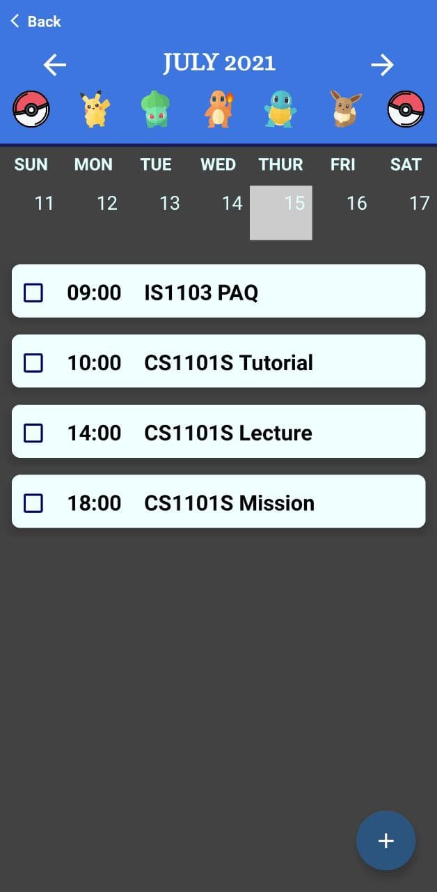

In the week view page, you will be able to add an activity for the selected date by clicking on the `+` button on the bottom left hand corner of the screen. 
You will be required to key in the following information: 
1. `Title`
2. `Start time`
3. `End time`

You will be able to edit/delete the details of your activity by clicking on the activity that you wish to edit/delete.

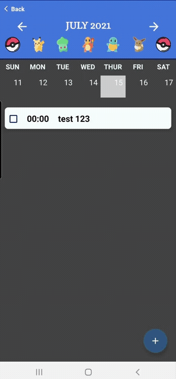 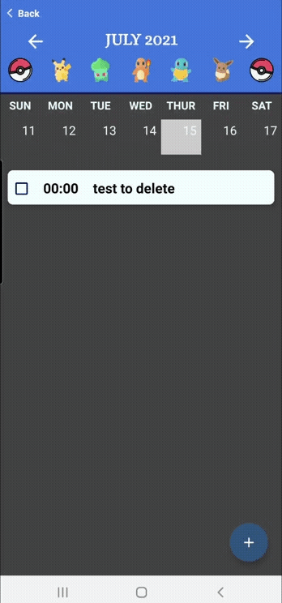

After completing an activity, you can check on the checkbox and receive your rewards.

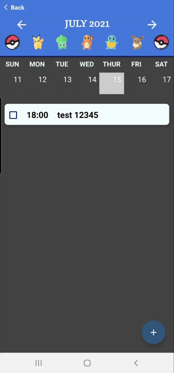

Additional feature: If you are unsure of how this section works, you can click on the `?` icon on the top left hand corner.

## Important Tasks

You will be able to see your list of todos in this section. 

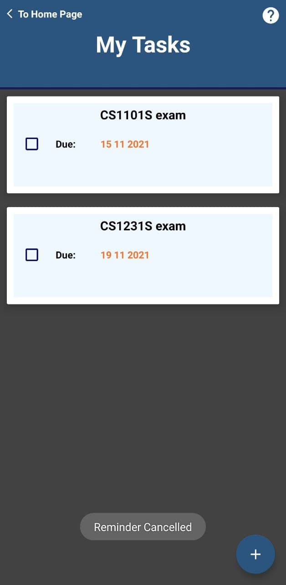

You can add new tasks by clicking on the `+` button on the bottom left hand corner of the screen.
You will be required to key in the following information: 
1. `Title`
2. `Description` (optional)
3. `Due date`
4. `Set Reminder` - switch it on if you wish to receive reminders on the due date, otherwise switch it off.

 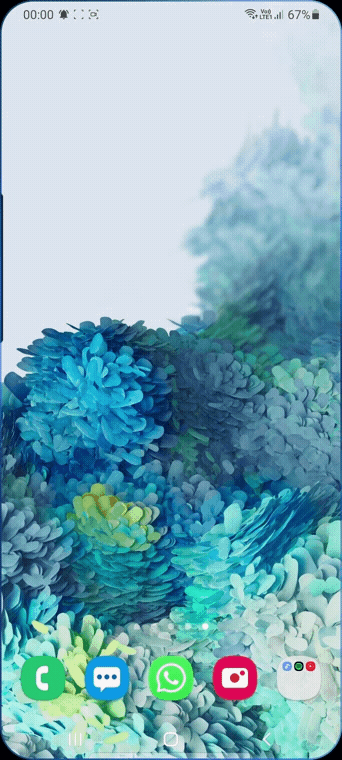

You will be able to edit/delete the details of your task by clicking on the task that you wish to edit/delete.

 

Additional feature: If you are unsure of how this section works, you can click on the `?` icon on the top left hand corner.

## My Pets

You will be able to see your pets in this section, along with its level and experience points.'
On completing tasks in `My Planner` section, experience points will be awarded to your pet accordingly.
As the pet earns experience points, it will level up.
Once the pet reaches a certain level, it will automatically evolve to the next evolution (if applicable).

However, do take note that for you pet to receive experience points, your completed tasks must be atleast **30 minutes** long.

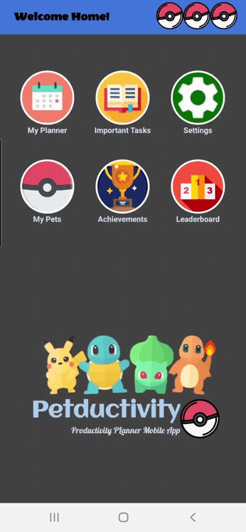

## Achievements

You will be able to see all the achievements you have unlocked in this section.
As you completes your tasks in `My Planner` section, you will be rewarded (randomly) with an achievement.
However, if you have already unlocked a certain achievement, there is no guarantee that you will not receive the same achievement again. (It's all about **RNG**!)

For the current version, there are a total of 302 different achievements that you can aim to collect. 151 Kanto region Pokémon and 151 **Shiny** Kanto Region pokemon.

Pokemon from other regions will be progressively added into the list of collectible achievements as the application continues to develop.

Additional feature: If you are unsure of how this section works, you can click on the `?` icon on the top left hand corner.

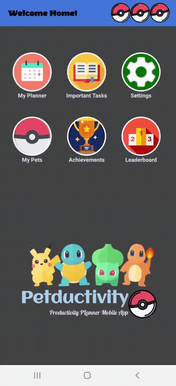

## Leaderboard

You will be able to see your rankings among all other app users in this section.
You can make use of this section to see how productive you have been (if you are the competitive type).

## Focus Mode

**Additional reward** feature for the application.
Focus Mode will be unlocked when you completes everything you have planned out for the day.
**Bonus** experience points and achievement will be given when you unlock Focus Mode.
**Bonus** experience points will be scaled according to the amount of tasks and the duration of each task planned for the day.

However, do take note that Focus Mode can only be unlocked **once per day**.

## Settings

In this section, you can change your account settings.

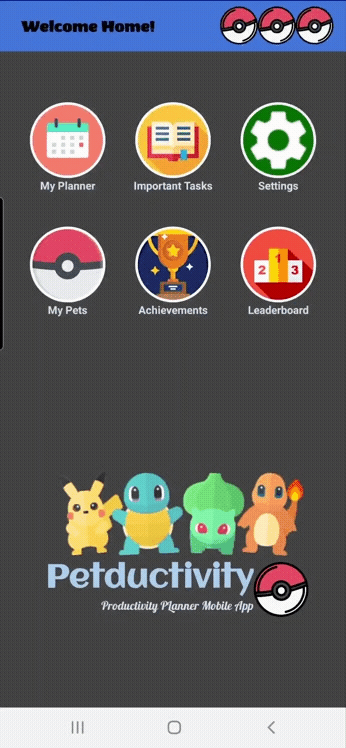

### Change Name

Allows you to change your account name, which will be displayed in the `Leaderboard` section.

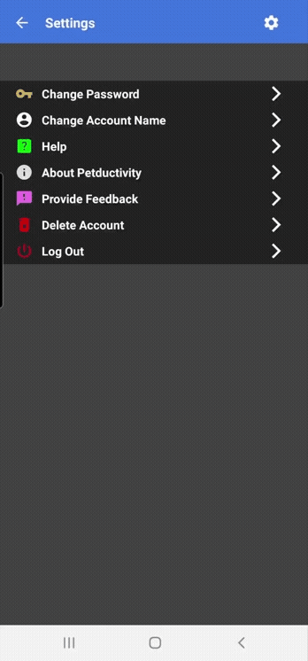

### Change Password

Allows you to change your account password.

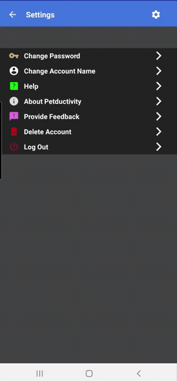

### Help 

Allows you to view commonly asked questions and commonly faced difficulties.
You can also find our email address and contact us directly.

### About Petductivity

Allows you to find out more about this application.

### Provide Feedback

Click on the `Petductivity Feedback Form`.
This will bring you to your browser where a google form will be loaded. You can provide your feedback through the google forms.

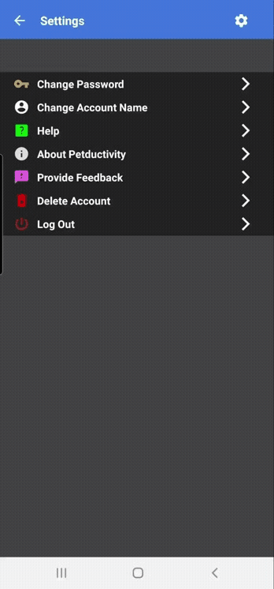

### Delete Account

Allows you to delete your account, including all of your account data.

### Logout

Allows you to logout of your current account.

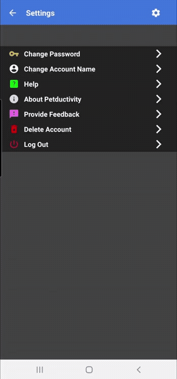

## Acknowledgement
1. Pokémon Icons by [ARTIFICIAL DESIGN](http://theartificial.nl/pokemonicons/)
2. [Pokeball Icon](https://www.flaticon.com/free-icon/pokeball_287221?term=pokeball&page=1&position=1&page=1&position=1&related_id=287221&origin=search) 
 made by Nikita Golubev from www.flaticon.com     
3. [My Planner Icon](https://www.flaticon.com/free-icon/calendar_425868?term=scheduler&page=1&position=53&page=1&position=53&related_id=425868&origin=search) made by Vectors Market from www.flaticon.com
4. [Important Tasks Icon](https://www.flaticon.com/free-icon/open-book_1903162?term=books&page=1&position=70&page=1&position=70&related_id=1903162&origin=search) made by Frrepik from www.flaticon.com
5. [Pokémon Icon](https://www.flaticon.com/free-icon/pokeball_361998?term=pokeball&page=1&position=11&page=1&position=11&related_id=361998&origin=search) made by Nikita Golubev from www.flaticon.com
6. [Achievements Icon](https://www.flaticon.com/free-icon/trophy_861506?term=trophy&page=1&position=18&page=1&position=18&related_id=861506&origin=search) made by Freepik from www.flaticon.com
7. [Phone Icon](https://www.flaticon.com/free-icon/smartphone_2933242?term=phone&page=1&position=60&page=1&position=60&related_id=2933242&origin=search) made by Freepik from www.flaticon.com
8. [Pokemon achievement Icon](https://www.flaticon.com/free-icon/new_189012?term=pokemon&page=1&position=83&page=1&position=83&related_id=189012&origin=search) by Roundicons Freebies from www.flaticon.com
9. [App Icon](https://www.flaticon.com/free-icon/pokemon-go_871383?term=pokeball&page=1&position=72&page=1&position=72&related_id=871383&origin=search) by Freepik from www.flaticon.com
10. [Leaderboard Icon](https://www.flaticon.com/free-icon/podium_1386734?term=leaderboard&page=1&position=64&page=1&position=64&related_id=1386734&origin=search) by Freepik from www.flaticon.com 
11. [Medal Icon](https://www.flaticon.com/free-icon/medal_744922?term=medal&page=1&position=4&page=1&position=4&related_id=744922&origin=search) by Vectors Market from www.flaticon.com
12. Other icons used from Android Studio Vector Assests.

## Disclaimer

This app is not affiliated, endorsed or supported by Nintendo Pokemon in any way.
All Pokemon Images, names and references are trademark of Nintendo, no copyright infringement intended.
All icons and images used are property of the original artist, no copyright infringement intended.

This application is made for the sole purpose of Orbital 2021 project and it is not for commercial purpose.

